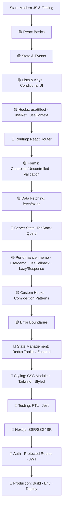

Here’s a clean **React Learning Visual Flow** in pure `.md` you can drop into Notion/GitHub. It includes a Mermaid diagram + checklists you can tick off.

---

# React.js Learning Roadmap

> **Legend:** 🟢 core · 🟡 important · 🔵 ecosystem · 🧪 testing · 🚀 next step

---

## ✅ Stage 0 — Prep (JavaScript & Setup)

* [ ] ES6+: `let/const`, arrow fn, destructuring, rest/spread
* [ ] Modules, imports/exports
* [ ] NPM/Yarn/PNPM basics
* [ ] Vite or Create React App (prefer Vite)
* [ ] Devtools: React DevTools, browser DevTools

---

## ✅ Stage 1 — Core React (🟢)

* [ ] JSX syntax & rules (`className`, expressions)
* [ ] Components (functional), props & children
* [ ] `useState` (updates, functional setState)
* [ ] Event handling (`onClick`, `onChange`)
* [ ] Conditional UI (ternary, `&&`)
* [ ] Lists & keys (stable keys!)

**Milestone:** Build a small **Todo** or **Counter + List** app.

---

## ✅ Stage 2 — Essential Hooks & Routing (🟡 🔵)

* [ ] `useEffect` (deps array, cleanup, common pitfalls)
* [ ] `useRef` (DOM refs, persistent values)
* [ ] `useContext` (avoid prop drilling for simple globals)
* [ ] **React Router**: routes, nested routes, params, loaders (if needed)

**Milestone:** Build a **Multi-page Notes App** with routing.

---

## ✅ Stage 3 — Forms & Data (🟡 🔵)

* [ ] Forms: controlled vs uncontrolled
* [ ] Basic validation (custom or library)
* [ ] Data fetching with `fetch`/`axios`
* [ ] Loading/empty/error states

**Milestone:** Build a **CRUD Contacts App** with a mock API (JSON Server).

---

## ✅ Stage 4 — Server State & Performance (🔵 🟡)

* [ ] TanStack Query (React Query): queries, mutations, cache, invalidation
* [ ] Perf: `React.memo`, `useMemo`, `useCallback`
* [ ] Code-splitting: `React.lazy` + `Suspense`

**Milestone:** Convert your CRUD app to **TanStack Query** and add pagination.

---

## ✅ Stage 5 — Patterns & Reliability (🟡)

* [ ] Custom hooks (extract reusable logic)
* [ ] Composition > inheritance (slot patterns, render props when needed)
* [ ] Error boundaries (fallback UIs)

**Milestone:** Publish a small **NPM custom hook** (optional).

---

## ✅ Stage 6 — State & Styling (🔵)

* [ ] **Redux Toolkit** (slices, RTK Query) or **Zustand** (simpler)
* [ ] Styling: CSS Modules / Tailwind / Styled Components
* [ ] Theming & dark mode basics

**Milestone:** Add **auth UI state** + global theme to your app.

---

## ✅ Stage 7 — Testing (🧪)

* [ ] React Testing Library (queries, user events)
* [ ] Jest basics (mocks, assertions)
* [ ] Test async UI & forms

**Milestone:** 5–10 meaningful tests for a critical flow.

---

## ✅ Stage 8 — Next Steps (🚀)

* [ ] **Next.js** (SSR/SSG/ISR, file routing, API routes)
* [ ] Auth: JWT, protected routes, refresh tokens
* [ ] Env & configs, error tracking (Sentry), logging
* [ ] Deployment: Vercel/Netlify, CI basics

**Milestone:** Deploy a **Full-stack Next.js app** with auth and a database.

---

## 📦 Project Ladder (use as checkpoints)

* [ ] Level 1: Counter, Color Picker, Tabs
* [ ] Level 2: Todo with filters + localStorage
* [ ] Level 3: Notes/Contacts CRUD with Router
* [ ] Level 4: Movies/Books search (API + Query caching)
* [ ] Level 5: Kanban or Trello-like board (Zustand/Redux)
* [ ] Level 6: E-commerce mini (cart, filters, pagination, checkout UI)
* [ ] Level 7: Next.js blog with MDX + ISR
* [ ] Level 8: SaaS starter (auth, billing stub, dashboard)

---

## 🛠️ Tooling & Quality (sprinkle in as you grow)

* [ ] ESLint + Prettier
* [ ] TypeScript with React (`FC`, props, generics in hooks)
* [ ] Git basics: feature branches, PRs
* [ ] Commit hygiene & conventional commits

---

## 🗺️ How to Use This Roadmap

1. Follow the **Mermaid flow** top-to-bottom.
2. For each stage, finish the **milestone project**.
3. Tick the checkboxes as you go.
4. Save this file in your repo/Notion and iterate.

